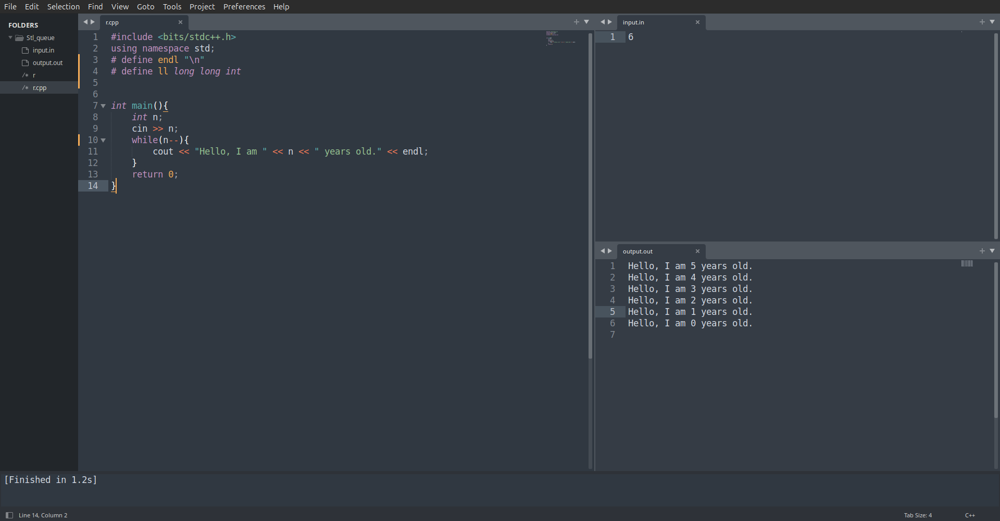

# Sublime-text-CP-Build

## Setup Instructions

### Step 1: Configure the Build System
1. Open ***Sublime Text***.
2. Navigate to `Tools > Build System > New Build System`.
3. Paste the code from:
   - [`./for_linux.txt`](./for_linux.txt) for Linux systems.
   - [`./for_windows.txt`](./for_windows.txt) for Windows systems.
4. Save the file with any name you like, e.g., `CP.sublime-build`.

### Step 2: Create Input and Output Files
1. In the same directory where you are coding, create two files:
   - `input.in`
   - `output.out`

### Step 3: Layout Configuration
1. Set up the layout for better workflow:
   - Go to `View > Layout > Columns: 3`.
   - Then, select `View > Groups > Max Columns: 2`.
2. Adjust the tabs to resemble the layout shown in the image below.

   **Example Layout**  
   

### Step 4: Running Your Code
1. Go to `Tools > Build Systems` and select your new build system
2. Write the input in `input.in`.
3. Run your code using the configured build system.
4. The output will appear in `output.out`.

---

### Notes
- Make sure to save all files before running the code.

Happy coding! 🚀
